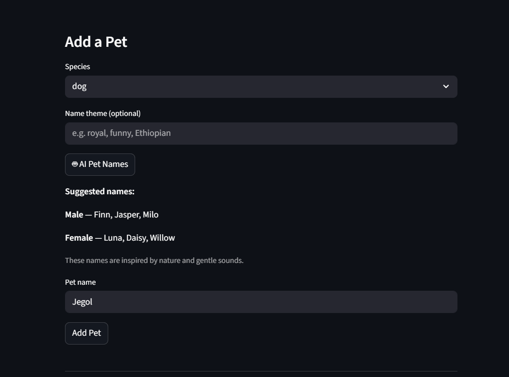
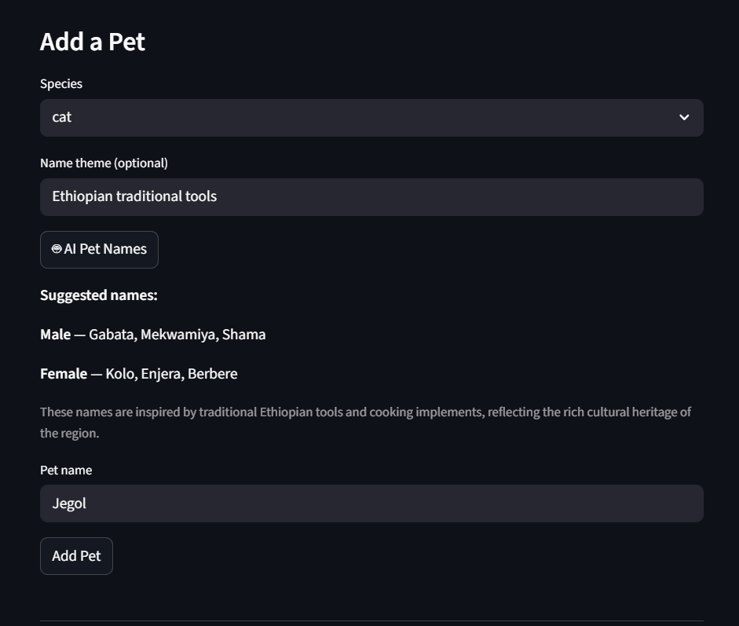
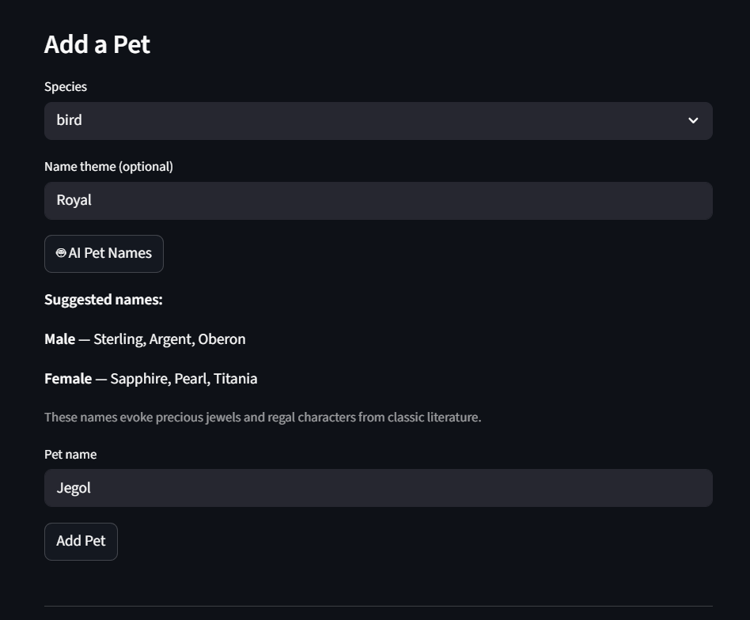
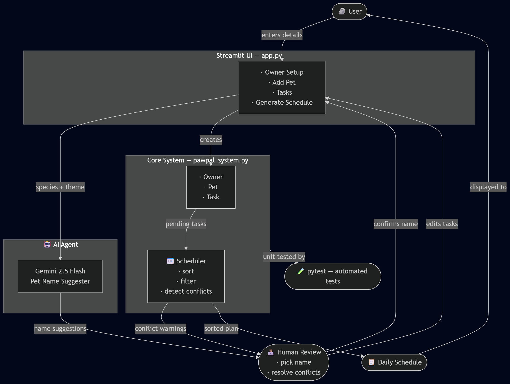

# 🐾 PawPal+ ~ AI-Enhanced Pet Care Scheduler

> A smart pet care management app that schedules daily routines, detects conflicts, and uses a Gemini AI agent to suggest pet names from species and themes provided by the user.

---

## Original PawPal

**PawPal** was originally built in Module 2 as a pure Python pet care scheduling system. The goal was to help a busy pet owner manage multiple pets and their daily care routines by modeling owners, pets, and tasks as structured Python classes.

---

## 🐾PawPal+ with Ai✨

**PawPal+** solves a real problem: keeping track of feeding times, walks, medications, and vet calls across multiple pets without anything slipping through the cracks. It matters because missed medications or skipped vet calls have real consequences for animal health.

This project extended the system with a **Gemini AI agent** that suggests pet names based on species and an optional theme. This turns PawPal+ from a pure scheduling tool into an end-to-end pet management assistant from naming a new pet all the way to generating its daily care schedule.

---

## Architecture Overview

```
🗿 User
   ↓ fills forms
Streamlit UI (app.py)
   ├── species + theme ──→ Gemini 2.5 Flash-Lite (AI Agent) ──→ name suggestions
   │                                                                   ↓
   │                                                    
   👨🏽‍💻 Human picks a name
   ↓ creates
Core System (pawpal_system.py)
   ├── Owner · Pet · Task  (data models)
   └── Scheduler  (sort · filter · conflict detection · generate plan)
                    ↓
             📋 Daily Schedule  ──→ displayed to User
                    ↓
          conflict warnings ──→ 👨🏽‍💻 Human reviews & edits
                    ↓
          🧪 pytest  (unit tests validate all core logic)
```

The system has four layers:

| Layer | What it does |
|---|---|
| **Streamlit UI** | Collects input across 4 sections; renders tables, warnings, and schedule |
| **AI Agent** | Calls Gemini 2.5 Flash-Lite with the chosen species and optional theme; returns 3 male + 3 female name suggestions |
| **Core System** | Python data classes handle all state; Scheduler runs sorting, filtering, conflict detection, and plan generation |
| **Human-in-the-Loop** | Owner reviews AI name suggestions before confirming, and reviews conflict warnings before generating a schedule |

---

## Setup Instructions

### 1. Clone the repo

```bash
git clone https://github.com/Baelak/Applied-Ai-System
cd Applied-Ai-System
```

### 2. Create and activate a virtual environment

```bash
python -m venv .venv

# macOS / Linux
source .venv/bin/activate

# Windows
.venv\Scripts\activate
```

### 3. Install dependencies

```bash
pip install -r requirements.txt
```

### 4. Add your Gemini API key

Create the file `.streamlit/secrets.toml` (this file is git-ignored and never committed):

```toml
GEMINI_API_KEY = "AIza..."
```

Get a free key at [aistudio.google.com/app/apikey](https://aistudio.google.com/app/apikey).

### 5. Run the app

```bash
streamlit run app.py
```

### 6. Run the CLI demo (no UI required)

```bash
python pawpal_system.py
```

### 7. Run the test suite

```bash
python -m pytest tests/test_pawpal.py -v
```

---

## Sample Interactions

### Example 1 — Dog names, No theme

**Input:** Species: `dog` · Theme: *(empty)*

**AI Output:**
```
Male — Finn, Jasper, Milo
Female — Luna, Daisy, Willow

These names are inspired by nature and gentle sounds.
```

---

### Example 2 — Cat names, Ethiopian theme

**Input:** Species: `cat` · Theme: `Ethiopian`

**AI Output:**
```
Male — Gabata, Mekwamiya, Shama
Female — Kolo, Enjera, Berbere

These names are inspired by traditional Ethiopian tools and cooking implements, reflecting the rich cultural heritage of the region.
```

---

### Example 3 — Bird names, Royal theme

**Input:** Species: `bird` · Theme: `royal`

**AI Output:**
```
Male — Sterling, Argent, Oberon
Female — Sapphire, Pearl, Titania

These names evoke precious jewels and regal characters from classic literature.
```

---

## Design Decisions

Streamlit kept the entire project in Python with no frontend code needed, Gemini 2.5 Flash-Lite was chosen for the AI agent because it's fast and free with no local GPU required. The human in the loop design was a deliberate choice. AI name suggestions and conflict warnings are surfaced to the user but never acted on automatically, keeping the owner in control. The main trade-offs were simplicity over optimality. A greedy scheduler, session-based storage with no database, and a preset task list which are all fast to build and easy to reason about, with known limitations that are acceptable for this scope.

---

## Testing Summary

**13 tests across 5 categories**

| Category | Tests | Outcome |
|---|---|---|
| Task completion | 2 | ✅ Passed — `mark_complete()` and task count both verified |
| Chronological sorting | 2 | ✅ Passed — out-of-order and same-hour edge cases covered |
| Recurring tasks | 3 | ✅ Passed — daily (+1 day), weekly (+7 days), once (no follow-up) |
| Conflict detection | 3 | ✅ Passed — same time, overlapping, and back-to-back all correct |
| Edge cases | 3 | ✅ Passed — empty pet, owner with no pets, all tasks over budget |

### Confidence level

★★★★☆ (4 / 5)

The core scheduling logic is fully tested and reliable, but the AI name suggester has no automated reliability checks. Gemini's output format varies between calls, meaning the parser can silently return nothing without throwing an error, so the AI portion is functional but not provably consistent.

### What worked well
- Testing the `Scheduler` class in isolation was straightforward because it takes plain lists of `Task` objects with no mocking required.
- The conflict detection tests caught a subtle bug early. Back to back tasks where one ends exactly when the next starts were initially being flagged as conflicts incorrectly.

### What wasn't tested
- **`expand_recurring` helper** — the logic that duplicates daily tasks 12 hours later has no dedicated test.
- **Gemini API responses** — the AI output format is not validated; if Gemini changes its response structure, the name parser would silently break.

### What I learned
Writing tests before adding features like the remove/edit task feature made regression checking instant. The edge case tests in particular revealed assumptions that weren't obvious until they broke.

---

## Reflection

Honestly, getting Gemini to return a useful answer was the easy part. The harder part was figuring out where the human should stay in control and what happens when the API goes down. Keeping the AI as a suggestion tool rather than an automation was the best call I made on this project. I also learned that the messiest part of building an AI app isn't the AI, it's the state management around it. If I were to keep building this, I'd add an AI scheduling assistant that recommends task times based on the pet's species, which feels like a much more interesting use of a language model than name suggestions. One thing worth noting is that the name suggester has a clear bias toward Western naming conventions without a theme, Gemini defaults to names like Max or Luna almost every time. The misuse risk is low since it's just pet names, but the theme field could technically be used to prompt the model toward inappropriate content. Gemini's built-in safety filters handle most of that, and the fact that the user has to manually type the name adds another layer. 

As for working with Claude Code on this project, it was genuinely useful, one helpful moment was when it flagged that my API key will be publicly exposed and suggested moving it to a secrets file. The one time it got things wrong was writing `gemini-1.5-flash` as the model name, which threw a 404 because that ID was no longer valid. A good reminder that AI tools can be confident and wrong at the same time.

---

## System Diagram

---

## Demo

### [🐾PawPal+ Walkthru Video](https://drive.google.com/file/d/1_vD7UNzo6PYSkBlfJJ9p56fnWCPnnj_e/view?usp=sharing)
